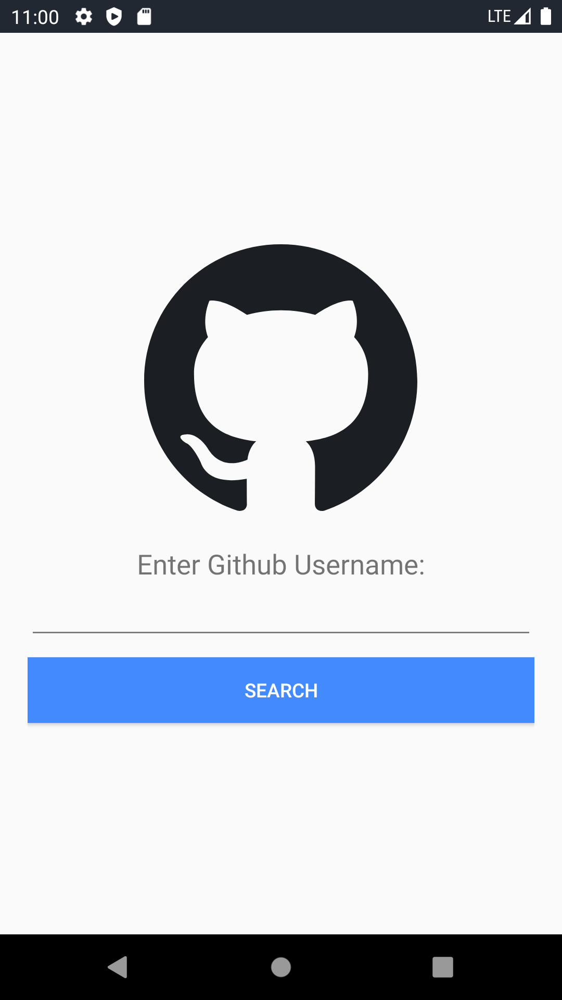
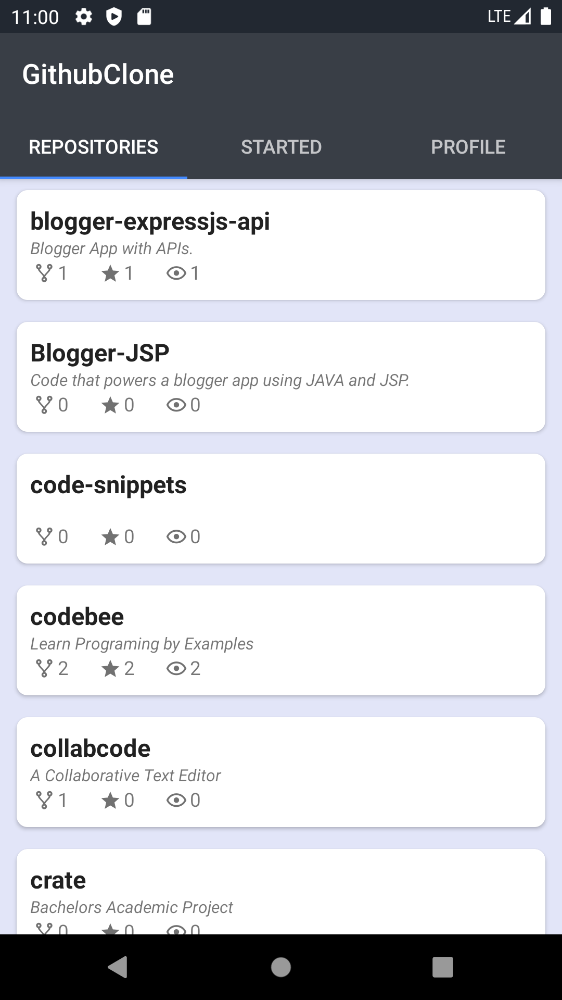
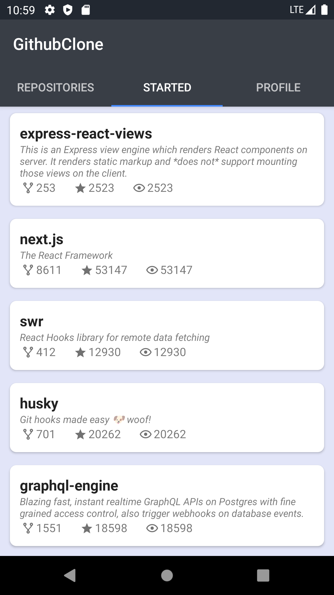
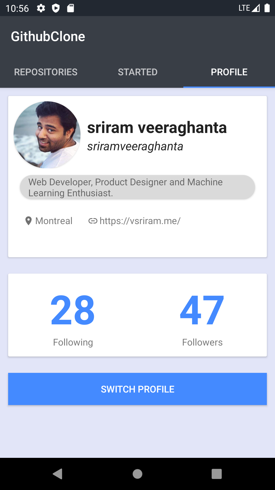
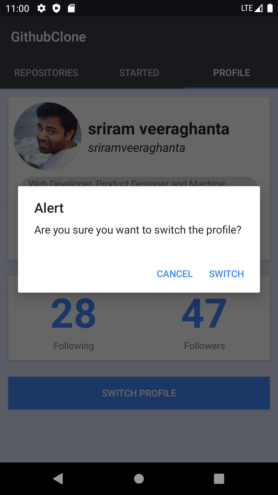

# Github Clone

A Simple Android Application using github APIs.

In this application you can find the github users using thier username and find thier profile, List of repositories owned by the user and also starred repositories. Implemented a Tab Layout for display and recycler view for rendering the repository cards list.

## Screenshots

## External Libraries Used.

- gson
- androidx.recyclerview
- picasso
- retrofit2
- retrofit2:converter
